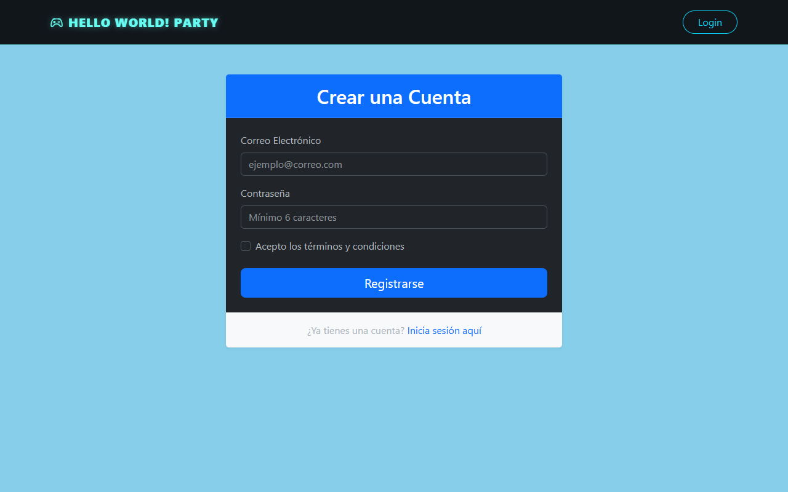
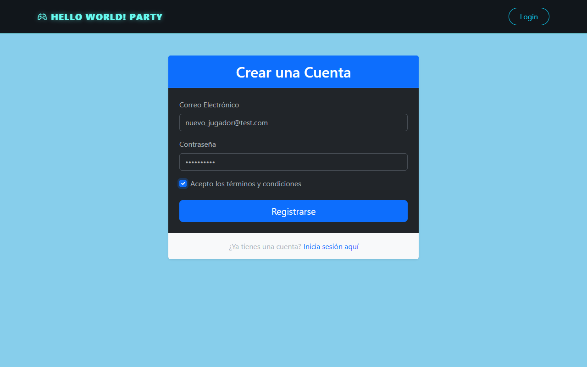
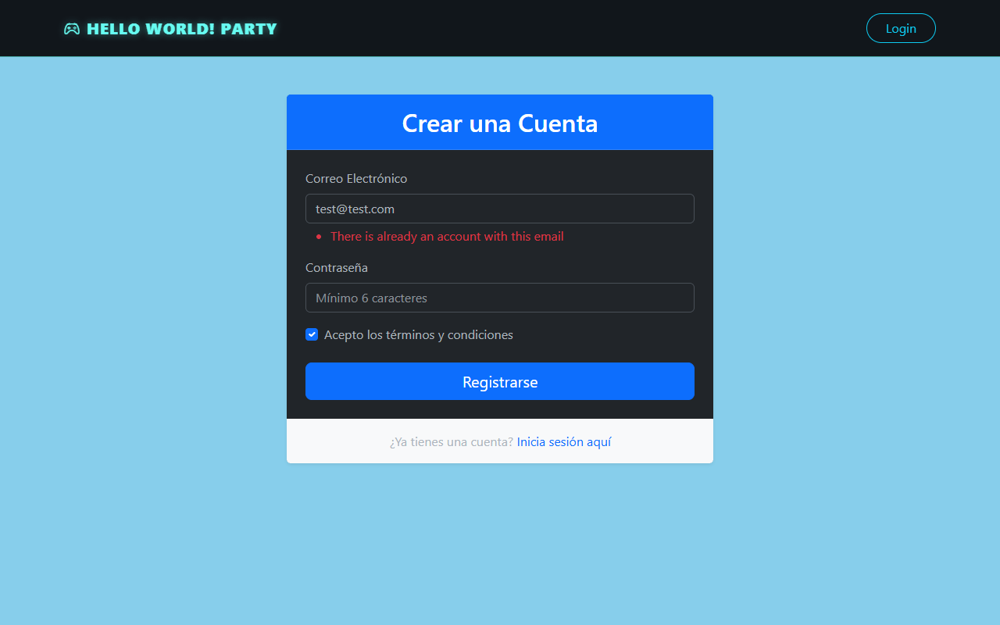
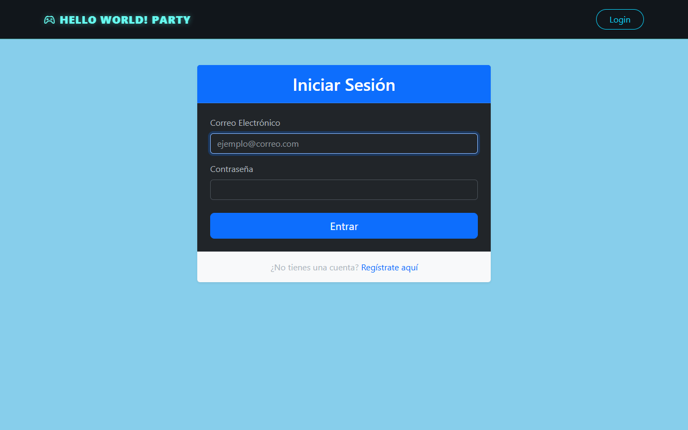
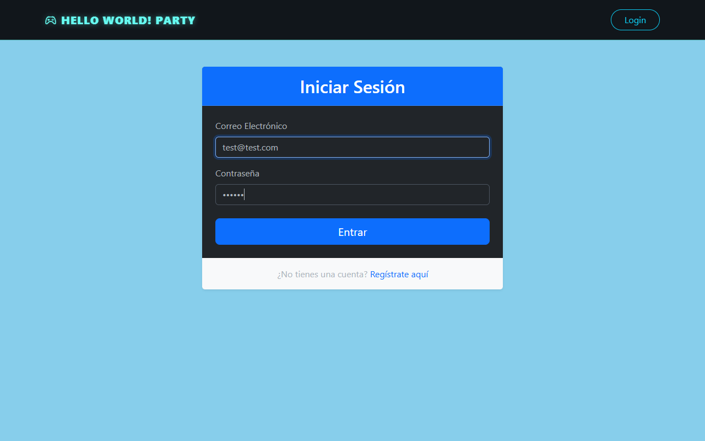

# Ejercicio de Entrega Parcial TFG: Módulo de Autenticación

**Autor:** [Tu Nombre / Manuel Prieto Macias]
**Proyecto:** Hello World! Party (Plataforma de Aprendizaje de Lógica de Programación)

---

## 1. Capturas de Pantalla de la Página de Inicio (Home)

Mi página de inicio (Home) ha sido desarrollada utilizando el motor de plantillas **Twig** (`home/index.html.twig`) y hereda la estructura principal de `base.html.twig`. He optado por una estética inmersiva de simulación/videojuego ("Hello World! Party") para mantener la atención del usuario.

> 

Como se puede observar en la captura, la ruta `/home` (y también `/`) está correctamente configurada a través de `HomeController`.

---

## 2. Capturas de Pantalla del Formulario de Registro

El módulo de registro se gestiona mediante `RegistrationController` y hace uso de `UserPasswordHasherInterface` para asegurar el guardado correcto y seguro de las credenciales en la base de datos.

### Formulario Vacío
> 

### Formulario con Datos Válidos antes de Enviar
> 

### Mensaje de Error en Validación Fallida
> 

---

## 3. Capturas de Pantalla del Formulario de Login

La autenticación está delegada en el sistema de seguridad de Symfony (`security.yaml`) y es gestionada visualmente por `SecurityController`.

### Formulario Vacío y con Credenciales Válidas
> 
> 

### Panel de Usuario tras Login Exitoso
Una vez el usuario se autentica correctamente, el `target` de mi firewall en `security.yaml` redirige de vuelta a `app_home`. La plantilla de Twig detecta la sesión activa (``) y en lugar de mostrar la Landing Page, muestra el **Dashboard del Jugador**.

> 

---

## 4. Evidencia de Conexión con la Base de Datos

He configurado Doctrine ORM para mapear la entidad `User.php`. Para el desarrollo ágil en local estoy usando SQLite, pero mi archivo `docker-compose.yaml` está preparado para levantar una base de datos robusta en un entorno de producción o pruebas.

A continuación, se muestra el volcado real de la tabla de usuarios desde el gestor de base de datos, evidenciando la inserción de registros reales y el hasheo de contraseñas:

> 

*(Evidencia: La conexión es exitosa. Se insertan registros desde los formularios de Symfony a la base de datos `var/data.db`)*.

---

## 5. Breve Descripción Técnica y Arquitectura

La implementación de este módulo fundamental se ha realizado siguiendo las directrices del seminario y las buenas prácticas del framework **Symfony 7.0**:

1. **Entidades y ORM (Doctrine):** 
   Se ha definido la entidad `App\Entity\User`, que implementa `UserInterface` y `PasswordAuthenticatedUserInterface`. Esta entidad almacena el `email` (identificador único), `password` (hasheada), los `roles` (array JSON), el `xp` del usuario (entero para la gamificación) y un `username` para la personalización en el juego.
   
2. **Controladores y Rutas:**
   * `HomeController`: Gestiona la ruta `#[Route('/home', name: 'app_home')]` y la ruta raíz `/` (que redirige al home). Evalúa si el usuario está logueado para renderizar distintas secciones de la plantilla. También maneja la ruta `/change-username` para actualizar el apodo.
   * `RegistrationController`: Intercepta el POST del formulario de registro, valida la unicidad del correo (`UniqueEntity`) y delega el hasheo de la contraseña al servicio de Symfony antes de realizar el `$entityManager->flush()`.
   * `SecurityController`: Proporciona la ruta `app_login` y gestiona el último error de autenticación (`getLastAuthenticationError`).

3. **Capa de Presentación (Twig):**
   Toda la interfaz hereda de la plantilla maestra `base.html.twig`, donde he integrado los assets (Bootstrap 5, iconos) y variables CSS personalizadas para el tema *"Gamer Neón"*. Uso bloques condicionales (``) tanto en el menú de navegación como en `home/index.html.twig` para mostrar u ocultar los botones de Login/Registro dependiendo de la sesión activa.

4. **Seguridad y Contraseñas (Píldora de Investigación):**
   Como sugiere la práctica, he analizado el manejo de contraseñas. Symfony por defecto, en `security.yaml`, usa el hasher `'auto'`. Esto significa que Symfony seleccionará automáticamente el mejor algoritmo de hashing disponible en el servidor (típicamente **Argon2id** o **Bcrypt**). Estos algoritmos aplican un *salt* automático por cada usuario, lo que mitiga drásticamente ataques de tablas arcoíris (*rainbow tables*), haciendo que mi base de datos sea segura. El logout redirige fluidamente mediante el parámetro `target: app_home` configurado en el firewall principal.

---
*Fin del Documento
