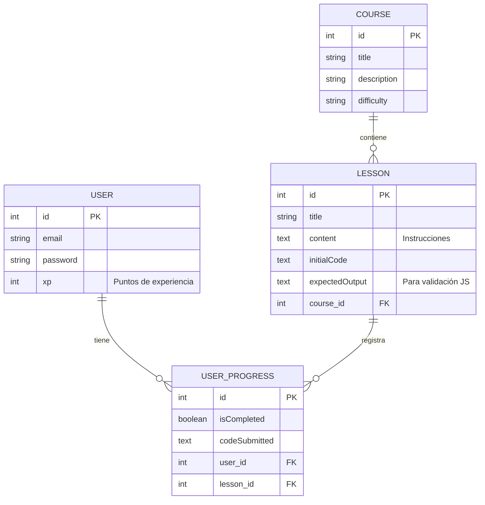

# Seguimiento y Avances del TFG: Plataforma de Aprendizaje

Este documento recoge el progreso del desarrollo de la Plataforma de Aprendizaje de Lógica de Programación. Su objetivo es documentar las fases completadas para facilitar la redacción de la memoria y la preparación de la presentación final ante el tribunal.

---

## Fase 1: Entorno y Configuración Inicial

Para garantizar la portabilidad y rapidez en el desarrollo, el proyecto se ha configurado bajo las siguientes premisas tecnológicas:

- **Framework Backend:** Symfony 7/8.
- **Base de Datos:** SQLite (configurado como archivo local en `var/data.db`). 
- **Simulación de Entorno (Requisito):** Se ha generado un archivo `docker-compose.yaml` que define un contenedor MySQL para cumplir formalmente con las especificaciones técnicas solicitadas en la entrega.

### ¿Por qué se ha elegido SQLite específicamente?

La decisión técnica de utilizar SQLite en esta etapa de desarrollo responde a los siguientes motivos de diseño y eficiencia:

1. **Sin Dependencias Complejas (Zero-Configuration):** A diferencia de bases de datos como MySQL o PostgreSQL, SQLite no requiere la instalación, configuración ni el mantenimiento de un proceso en segundo plano en el sistema operativo. Esto permite clonar el repositorio e inmediatamente ejecutar el proyecto en cualquier máquina (incluido el ordenador del tribunal) sin frustraciones técnicas.
2. **Portabilidad Absoluta:** Toda la base de datos se almacena en un único archivo físico (`var/data.db`). Hacer copias de seguridad de la base de datos o trasladarla a otro equipo es tan fácil como copiar y pegar un archivo.
3. **Escalabilidad Sostenible para el TFG:** Dado que el alcance del TFG (Plataforma de Aprendizaje Interactiva) está pensado para demostraciones conceptuales y para un volumen de usuarios concurrente bajo, SQLite ofrece un rendimiento transaccional excelente y es el motor de base de datos ideal para la validación de prototipos. Si en un futuro fuera necesario escalar la plataforma a nivel productivo masivo, Doctrine ORM permite migrar a MySQL simplemente cambiando una línea en el archivo `.env`.

---

## Fase 2: Módulo de Autenticación y Seguridad

El primer gran hito del proyecto es garantizar que cada estudiante (jugador) y administrador (docente) pueda identificarse de forma segura.

### ¿Qué se ha implementado?

1. **Entidad de Usuario (`User`):** Se ha creado el modelo de datos gestionado por Doctrine ORM, almacenando credenciales y roles.
2. **Registro de Usuarios:** 
   - Formulario validado para el alta de nuevos estudiantes.
   - Contraseñas hasheadas automáticamente (mediante el componente de seguridad de Symfony).
3. **Inicio y Cierre de Sesión (Login/Logout):**
   - Sistema de autenticación integrado.
   - Redirecciones seguras tras el login y el registro hacia la vista de *Dashboard/Home*.

### Vistas de Usuario (Frontend)

Se ha integrado el framework **Bootstrap 5** para proporcionar una interfaz limpia, adaptativa (responsive) y visualmente profesional sin invertir excesivo tiempo en CSS personalizado durante esta fase.

*Formulario de Registro de Nuevo Usuario:*

*Pantalla Principal (Usuario Autenticado):*

### Demostración Completa del Flujo

A continuación se puede visualizar una captura en vídeo del flujo completo (Navegación -> Registro -> Cierre de Sesión -> Inicio de Sesión):

---

## Fase 3: Arquitectura Coddy.tech (Nuevo Modelo Relacional)

Para transformar la base actual en una plataforma interactiva estilo "Coddy.tech" (enfocada en **JavaScript** y ejecución directa en navegador), hemos diseñado la siguiente arquitectura relacional para soportar Cursos, Retos y Gamificación:

### Diagrama Entidad-Relación (E-R)

### Explicación de las Nuevas Entidades y Relaciones

Para lograr un funcionamiento por "lecciones prácticas", hemos estructurado la base de datos de la siguiente forma:

1. **`Course` (Curso):** Esta tabla agrupa el contenido por temáticas (ej. "Introducción a JavaScript", "Bucles y Arreglos"). Sirve como la unidad organizativa principal de alto nivel.
2. **`Lesson` (Lección/Reto):** Es el corazón del aprendizaje. Cada *Course* contiene muchas *Lessons* (Relación 1 a N). Cada lección tiene instrucciones teóricas cortas (`content`), código de partida para el editor (`initialCode`), y el resultado exacto que se espera para validarlo (`expectedOutput`).
3. **`User` (Modificación):** Hemos evolucionado la entidad de usuario añadiendo la columna `xp` (Experience Points). Esto es vital para el aspecto de la **gamificación**; a medida que un estudiante supera lecciones, su `xp` aumentará.
4. **`UserProgress` (Progreso del Usuario):** Es la tabla pivote o de resolución que une a un `User` con una `Lesson` (Relación M a N desglosada). Aquí se guarda qué usuario ha completado qué lección (`isCompleted`) y cuál fue el código que envió para superarla (`codeSubmitted`). Esto permite rastrear el avance exacto de cada estudiante en cada momento.

---

## Próximos Pasos en el Desarrollo (Hoja de Ruta Activa)

Para finalizar la plataforma, estas son las tareas estructuradas que vamos a ir completando:

### 1. Inserción de Datos Base (Fixtures) - [COMPLETADO]
Se ha configurado `DoctrineFixturesBundle`. Se han creado automáticamente cursos de prueba (ej. "Fundamentos de JavaScript") y varias lecciones con código predefinido (`initialCode`) y resultados esperados (`expectedOutput`). Además, se inyectan dinámicamente un usuario administrador y un alumno de pruebas para garantizar la portabilidad del entorno en cualquier ordenador (portátil de presentación) sin necesidad de copias de seguridad de la BD física.

### 2. Frontend del Curso (Listado) - [COMPLETADO]
Se ha rediseñado la vista principal para mostrar el "Mundo" o Curso activo, calculando dinámicamente el progreso del jugador, su Avatar autogenerado y el diseño inmersivo post-apocalíptico.

### 3. Entorno de Ejecución (El Editor Interactivo)
El corazón de la plataforma estilo "Coddy.tech":
- **Vista de Pantalla Dividida:** Implementaremos una interfaz limpia donde la mitad de la pantalla muestre la teoría/instrucciones del reto, y la otra mitad contenga el editor de código.
- **Integración de Editor Profesional:** Usaremos **Ace Editor** o **Monaco Editor** mediante CDN para proporcionar resaltado de sintaxis JavaScript, números de línea y autocompletado directamente en la web.
- **Motor de Evaluación JavaScript:** Crearemos la lógica en el Frontend para ejecutar el código escrito por el usuario de forma asilada en su navegador (mediante funciones controladas o `iframe` en modo sandbox). Se capturará lo que el código imprima por consola (`console.log`) y se enviará mediante una petición AJAX al servidor, o bien se validará localmente, para determinar si coincide con la solución esperada.
- **Gamificación en Acción:** Cuando el usuario acierte, aparecerá una notificación de éxito, se registrará el reto como completado en la base de datos (creando una fila en `UserProgress`) y se sumarán puntos de experiencia (`xp`) a su perfil.

---

## Fase 4: Rediseño Visual, Narrativa y Sistema de Ayuda Inteligente

Para diferenciar verdaderamente este TFG y transformarlo en una experiencia inmersiva, se ha rediseñado la plataforma integrando una capa narrativa y gamificada de alto nivel. Estos son los puntos clave a exponer en la presentación:

### 1. Transformación Visual a "Hello World! Party" (Estilo Gamer)
Se ha abandonado el diseño tradicional de formulario web en favor de una **estética "Dark / Gamer"**. 
- **Inmersión Total:** Al iniciar sesión, desaparecen los menús clásicos. El usuario entra a un "Dashboard" que simula un panel de control avanzado.
- **HUD (Head-Up Display):** Integración de un Avatar, Rango del jugador (ej. Novato) y una barra visual de Puntos de Experiencia (XP) que otorga feedback continuo sobre el progreso.
- **Botón de Comando:** Si el usuario tiene el rango de Administrador Supremo (`ROLE_ADMIN`), se le habilita una interfaz de anulación (un botón para saltar directamente al panel de EasyAdmin del Backend).
- **Diseño Neón:** Uso de contrastes fuertes (fondos oscuros `#0b0c10` con acentos cian/neón `#66fcf1`) para crear una atmósfera tecnológica atractiva y profesional.

---

## Fase 5: Panel de Administración (Backend)

Para evitar la gestión de datos puramente a nivel de código y dotar al proyecto de una perspectiva docente:
- **EasyAdmin Bundle:** Se ha instalado y configurado un panel de administración profesional autogenerado en la ruta `/admin` (estrictamente protegida por cortafuegos de Symfony para `ROLE_ADMIN`).
- **Gestión Docente:** Desde este panel, el profesorado puede crear nuevos Cursos, escribir las instrucciones (Lore) de las Lecciones, definir el código inicial y el código esperado sin necesidad de tocar la base de datos.
- **Auditoría de Alumnos:** A través del CRUD de `UserProgress`, el profesorado puede inspeccionar el código exacto que los estudiantes envían para superar los niveles, previniendo trampas.

### 2. Narrativa Post-Apocalíptica (Inspiración "Fallout")
Se ha diseñado un **Storytelling** para dar contexto a los problemas lógicos, elevando el enganche (engagement) del estudiante:
- **El Contexto:** El mundo exterior ha colapsado. El estudiante interpreta al aprendiz de mantenimiento del "Búnker 42", encargado de reparar maquinaria crítica (generadores, puertas de seguridad) usando "código antiguo" (JavaScript).
- **El Tutor ("El Padre"):** Las lecciones teóricas no se presentan como texto plano de un libro, sino como transmisiones de radio de tu Padre (el Ingeniero Jefe del búnker), quien te enseña para que algún día puedas sobrevivir sin él. Esta capa emocional añade profundidad al aprendizaje.

### 3. Sistema de Pistas Inteligentes (Feedback Basado en Errores)
Para garantizar un aprendizaje efectivo sin frustración, se ha diseñado una arquitectura lógica en Frontend capaz de analizar por qué falla un estudiante y ofrecer ayuda personalizada a través del personaje del Padre:
1. **Atrapado de Errores de Sintaxis (`try...catch`):** Si el código se rompe por falta de un punto y coma o un paréntesis, el sistema lo detecta antes de colapsar y el Padre envía un mensaje específico (Ej: *"Hijo, el comando tiene un error de sintaxis..."*).
2. **Validación de Resultados Lógicos:** Se captura la salida estándar (`console.log`) en el navegador de forma aislada y se compara con el resultado esperado (`expectedOutput`). Si no coincide, el Padre orienta sobre el error de cálculo.
3. **Análisis de Código Estático (RegEx) - [COMPLETADO]:** Mediante Expresiones Regulares en JavaScript, se ha añadido la verificación de palabras clave (ej. evitando el uso de `var` e instando al uso de `let` o `const`). El sistema intercepta el error y "El Padre" avisa sobre la mala práctica antes de ejecutar el código.
4. **Manejo de la Frustración (Contador de Intentos) - [COMPLETADO]:** Se ha implementado un rastreador de fallos consecutivos. Si el estudiante se atasca y envía código erróneo (ya sea por lógica o sintaxis) 3 veces seguidas, el sistema interviene automáticamente con una alerta táctica de "El Padre" que le ofrece pistas mucho más explícitas sobre la sintaxis (llaves, comillas, paréntesis) y palabras de ánimo para evitar el bloqueo cognitivo.

### 4. Sistema de Experiencia (XP) con Propósito Narrativo
Se ha rediseñado la mecánica de puntuación para que no sea un número vacío, sino un elemento central de la progresión:
- **Nivel de Autorización:** El XP representa el "Nivel de Autorización de Seguridad" dentro del Búnker. El jugador necesita acumular cierta cantidad de XP para desbloquear el acceso a nuevas zonas (Mundo 2, Mundo 3) o "Archivos Clasificados" (lore extra).
- **Bonificaciones por Excelencia:** Se premia escribir buen código. Si un jugador supera el nivel a la primera sin errores, u optimiza el número de líneas, recibe multiplicadores de XP (ej. x1.5).

### 5. Modo Tutorial (Para Principiantes Absolutos)
Pensando en usuarios sin experiencia previa, se implementará un sistema inspirado en juegos educativos como *Flexbox Froggy*:
- **Fill-in-the-Blanks (Código Parcial):** En los primeros niveles, el editor no está vacío. El jugador se encuentra una plantilla con la estructura hecha (Ej: `let ______ = "Hola Mundo";`) y solo debe rellenar los huecos clave.
- **Manual de Supervivencia Visual:** Acompañando a la consola, habrá un panel donde el Padre resalta visualmente la sintaxis exacta necesaria.
- **Asistencia Activa - [COMPLETADO]:** Si el jugador se queda atascado (sin teclear nada en el editor) durante 45 segundos, el temporizador de inactividad hace saltar un mensaje de radio de "El Padre" en la terminal animándole a revisar las pistas del panel izquierdo.

---

## Fase 6: Sistema Narrativo Cinematográfico y "Clean Editor"

Para emular la excelencia de plataformas referentes (como *Flexbox Froggy* o plataformas modernas de gamificación de código), se ha refinado el flujo del minijuego separando estrictamente la historia de la programación pura:

1. **La Cinemática Inicial:** Antes de programar, el usuario aterriza en una pantalla de introducción oscura y con efectos retro (`/lesson/{id}/story`). Aquí recibe el **Lore** (una transmisión del Padre poniéndole en contexto de emergencia). Esto genera inmersión absoluta y reduce la carga cognitiva de leer largos textos en la pantalla de código.
2. **Entidad Bifurcada (BD):** Se modificó la arquitectura añadiendo un campo dedicado (`$lore`) a la tabla `Lesson` a través de Doctrine, separado del `$content` (que ahora sirve exclusivamente para almacenar pistas y trucos del lenguaje de programación).
3. **El "Clean Editor":** La pantalla de programación (`/lesson/{id}/play`) ha sido aliviada de ruido visual. Ahora alberga, a pantalla completa, el Ace Editor a la derecha, su terminal debajo, y un panel limpio y directo a la izquierda reservado únicamente para las **Reglas del Nivel** y la documentación técnica necesaria para superarlo.
4. **Backend Potenciado:** El *EasyAdmin* ha sido actualizado para proporcionar dos campos de texto enriquecidos (`TextEditorField`), permitiendo al profesor diseñar la narrativa visual y las instrucciones técnicas cómodamente, con soporte para resaltado de código en las ayudas (`<code>`).

---

## Fase 7: Mecánicas Finales de Progresión y Recompensas

Para completar el ciclo de gamificación y dar sentido a la evolución del estudiante en la plataforma, se han implementado las mecánicas finales que estructuran el avance a lo largo del juego:

### 1. Sistema Dinámico de Rangos (Narrativa de Ascenso)
En lugar de depender exclusivamente del XP numérico, el perfil del estudiante en el Dashboard evoluciona orgánicamente adquiriendo "Rangos" según el número de niveles superados (ej. pasando de *Chatarrero del Búnker* a *Arquitecto del Refugio*). Esto refuerza el sentido de pertenencia y logro.

### 2. Bloqueo de Mundos (Pruebas de Autorización)
Se han estructurado los contenidos en 3 grandes "Pruebas" (Mundos) con 3 niveles cada una.
La interfaz lista todas las pruebas disponibles, pero bloquea de manera visual y funcional el acceso a las Pruebas 2 y 3 (visualizadas en gris y con advertencias) hasta que el estudiante haya superado el número de niveles requerido. Esto garantiza una curva de aprendizaje secuencial.

### 3. La Libreta del Padre (Manual de Supervivencia)
Para evitar que el alumno abandone el "estado de flujo" de la plataforma buscando documentación externa en Google, se ha integrado un botón en la interfaz de programación que despliega un panel lateral (Offcanvas). Este panel simula ser unos apuntes antiguos del Padre con una *cheat-sheet* inmersiva sobre la sintaxis básica de JavaScript.

### 4. Recompensas Inteligentes (XP Multiplier)
El controlador del servidor ahora evalúa la eficacia del alumno a través del rastreador de fallos. Si el nivel se supera al primer intento sin cometer errores (`failedAttempts == 0`), el estudiante recibe una bonificación por "Excelencia" sumando **75 XP** en lugar de los 50 XP base. Esta mecánica incentiva el pensamiento analítico antes de ejecutar el código de forma compulsiva.

---

## Fase 8: Pulido Visual y Sensación de Juego (Game Feel / Juiciness)

Para elevar la calidad del TFG al nivel de un producto comercial, se ha implementado una capa final de *Polish* que potencia la inmersión del estudiante en el ecosistema del Búnker:

1. **Efecto Typewriter y Sonido Sintético (Web Audio API):**
   La cinemática de introducción a cada nivel no muestra el texto de golpe. Se ha desarrollado un script en JavaScript que "teclea" el contenido letra a letra. Para maximizar la inmersión sin depender de archivos MP3 externos, se ha utilizado la `Web Audio API` para sintetizar frecuencias de ondas cuadradas (Square Waves) que emulan el sonido robótico de una terminal antigua por cada letra impresa.
2. **Efecto Visual de Fallo Crítico (Glitch):**
   Aprovechando el rastreador de `failedAttempts`, si el estudiante falla más de 3 veces consecutivas, el contenedor de código completo sufre una animación CSS tipo *Shake/Glitch* (vibración rápida con sombra roja) simulando la inestabilidad de la terminal por los errores del alumno.
3. **Feedback Positivo Visual (Medallas de Excelencia):**
   Conectado con el Multiplicador de XP, si el alumno resuelve el nivel con código perfecto (0 fallos), la ventana de victoria transforma el trofeo estándar en una "Estrella de Oro" destellante. Este micro-feedback visual genera dopamina y fomenta que el estudiante repase su código mentalmente antes de pulsar "Ejecutar".

---
*Documento actualizado con la implementación final de las mecánicas de gamificación, progresión por rangos y la capa final de pulido visual y auditivo.*
